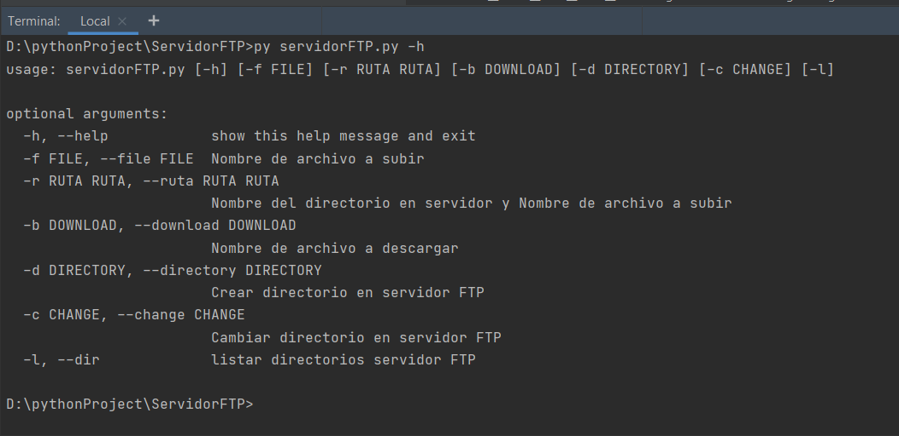
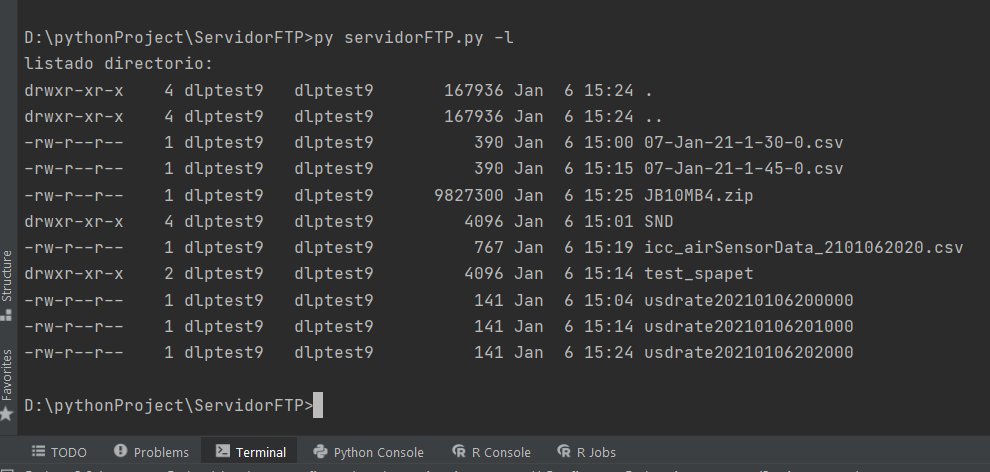
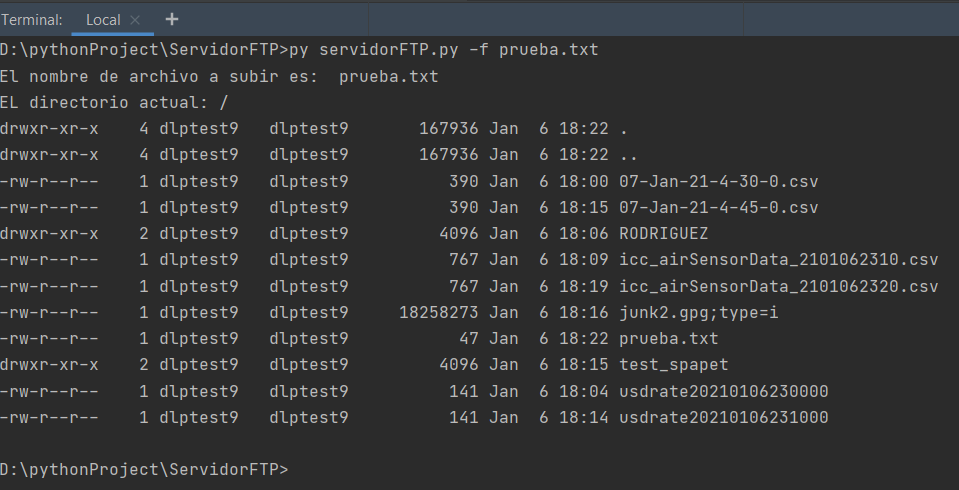
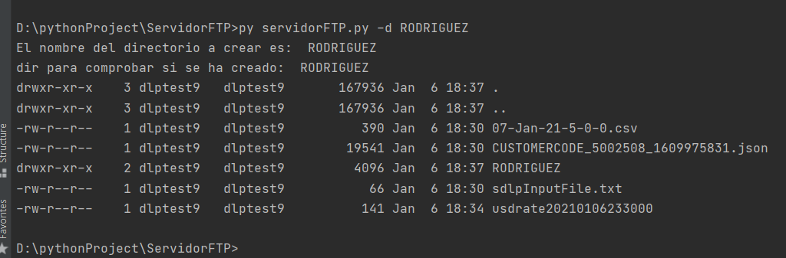

# Práctica 4.2 - Conexión a servicios en red (FTP)

<https://github.com/jrodriguezballester/Servidor-FTP.git>

## Ejercicio 2 - Conexión a servicios en red (FTP)

Vamos a crear un programa Python que podrá recibir tres parámetros y en función de ellos
actuará sobre nuestro servidor FTP.

El primer parámetro será -l, que nos permitirá listar los directorios que tenemos en el
servidor FTP.

El segundo parámetro será -d, que nos permitirá crear un directorio en el servidor FTP.

El tercer parámetro será -f, que nos permitirá depositar un fichero en el directorio
seleccionado.

Cuando ejecutemos el programa, éste deberá establecer la conexión con nuestro servidor
FTP y en función del parámetro que le pasemos, este realizará las acciones descritas
anteriormente.

La solución de la práctica será entonces:

- abrir la conexión listar los directorios,
- crear un directorio con vuestro apellido
- dentro del directorio subir un fichero llamado prueba.txt con
vuestro nombre y apellidos como contenido del mismo.

Os dejo según la guía de refencia de Python el módulo con el que podéis trabajar para
realizar la conexión FTP: ftplib

Uso de parámetros en la llamada a un script:
<https://www.tutorialspoint.com/python/python_command_line_arguments.htm>

Datos para la conexión FTP:

ftp = FTP('macbuighome.no-ip.info')

ftp.login('psp', '265nCwsEzG2Xv6XW')

La conexión al servidor FTP, tiene que ser en modo activo, de otra forma no os funcionará.
Documentación sobre el pase de parámetros a un script Python:
<https://www.tutorialspoint.com/python/python_command_line_arguments.htm>

## Resultado

En vez de utilizar el módulo getopt se ha utilizado argsparse <https://docs.python.org/3/library/argparse.html> entre otras cosas por <https://stackoverflow.com/questions/3217673/why-use-argparse-rather-than-optparse>

Se ha utilizado un servidor FTP Diferente al pasado en la documentación, por no poder conseguir la conexión; se ha utilizado uno de pruebas <https://dlptest.com/ftp-test/> ; los ficheros se destruyen cada 30 minutos; y la contraseña puede cambiar.

### parametro -h , help

### parametro -l, --dir

Hace un dir del directorio actual del servidor

### parametro -r, --ruta Directorio, Archivo

Nombre del directorio del servidor donde queremos subir nuestro archivo, Nombre del archivo

Sube el archivo del segundo parametro al directorio que le hemos indicado del servidor

### parametro -f, --file Archivo

sube el archivo al directorio actual del servidor; si se utiliza junto con el parametro -c, --change es similar al parametro -r, --ruta

### parametro -b, --download Archivo

Nombre del archivo a descargar, se puede utilizar con el parametro -c, --change para indicar la ruta

### parametro -d, --directory Directorio

Crea un directorio en el servidor

### parametro -c,--change Directorio

Cambia al directorio seleccionado. La implementación como opcion independiente se ha comentado, ya que en estos momentos no tiene sentido
